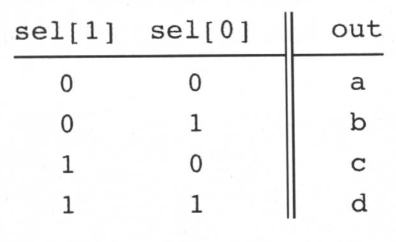
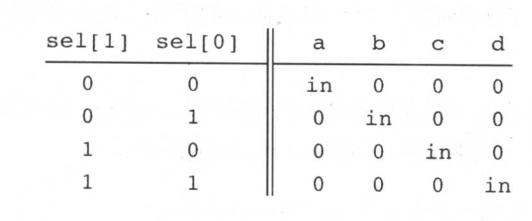
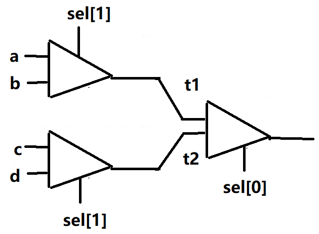

# lab01简介

> **目标**：实现本章提到的所有逻辑门。你能使用的构建模块只能是原始的Nand门以及由此所构建的一些复合门。
>
> **资源**：这个项目里你所需要的唯一工具是与本书配套的硬件仿真器。所有的芯片应该利用HDL语言（参看附录A)来描述。对于本章中提到的每种芯片，我们都提供了只有框架没有具体细节实现的.hd1骨干程序（文本文件）。另外，我们还提供了.tst脚本文件，用来告诉硬件仿真器如何进行测试，同时脚本文件将会产生一个正确的.cmp输出文件或称“比较文件（comparefile)”。你要做的就是完成空缺.hd1程序里面的具体实现部分。
>
> **约定**：当你设计的芯片（用.hd1程序表示）被加载到硬件仿真器中，并利用.tst文件进行测试后，应该在.cmp文件中生成输出列表。若结果不如所料，仿真器会给出相应的提示。
>
> **提示**：Nand门被认为是原始的逻辑结构,所以没有必要去构建它: 只要你在HDL 程序中使用Nand门,仿真器就会自动地调用其内置的tools/builtIn/Nand. hal工具。我们建议你在这个项目中按照本章介绍的顺序来实现其他的门。因为builtIn 目录下包括本书介绍的所有芯片模块,你可以直接使用而不用去定义它们:仿真器会自动调用其内置版本。
>
> 例如,来看一个项目里面提供的Mux.hal骨干程序:假设因为某种原因,你没有完成程序编写,但是仍然希望在其他芯片设计中将Mux门作为内部模块使用。这不成问题,因为(应该感谢这个约定):如果仿真器在当前路径下没有找到名为Mux. hdl 的文件,它将自动调用内置的、由仿真器的软件提供的Mux模块。该内置实现(即存放在builtIn路径下的一个Java类)具有跟本书中描述的那些Mux门相同的接口和功能。因此,如果想让仿真器忽略一个或多个你自己的实现,只需要将相应的.hdl 文件从当前路径下移除就行了。
>
> 建议按照如下步骤来进行:
>
> 0. 本项目需要用到的硬件仿真器放在与本书配套的软件包中(可从本书网站上下载)的tools目录里面。
> 1. 请阅读附录A的A.1至A.6小节。
> 2. 阅读硬件仿真器使用教程的第1.11、111部分。
> 3. 构建并仿真projects/01目录里面的所有芯片。

code

- 存放hdl代码

out&cmp&tst

- 存放输出文件、比较文件、测试数据

以上文件均可用文本文档打开。

# 实现

以下只给出相关的逻辑运算

## Not

这个时候我们只有Nand可以用
$$
Nand(a=in, b=in, out=out);
$$

## And

使用Not和Nand实现And
$$
Nand(a=a,b=b,out=out1);\\
    Not(in=out1,out=out);
$$

## Or

使用Not和And实现Or
$$
\overline{\overline {A} \ \overline {B}}
$$

## Xor

$$
A \overline{B} + \overline{A}B
$$

## Mux

$$
\overline{sel} \ A + sel \ B
$$

## DMux

$$
a =  \overline{sel} A \\
b = sel \ B
$$

## 多位Not

16位取反就是对每一位都取反

因为我们刚刚实现的Not是1位的，我们没有实现多位Not的接口，我们在自己实现一个，实现原理就是对每一位都取Not。

没错，就是你想的那样。遍历每一位.
$$
out[0]=\overline{in[0]} \\
out[1]=\overline{in[1]} \\
...\\
out[15]=\overline{in[15]}
$$

## 多位And

每一位都是And
$$
out[0] = a[0]b[0]\\
out[1] = a[1]b[1]\\
...\\
out[15] = a[15]b[15]
$$

## 多位Or

每一位都是Or
$$
out[0]=a[0]+b[0]\\
out[1]=a[1]+b[1]\\
...\\
out[15]=a[15]+b[15]
$$

## 多位Mux

每一位都是And

这里注意几个问题：

1. 内部管脚不是变量，不可以重复使用，以下例子：
   $$
   And(a=notSel,b=a[0],out=isA);\\
   And(a=sel,b=b[0],out=isB);\\
   Or(a=isA,b=isB,out=out[0]);\\
   And(a=notSel,b=a[1],out=isA);\\
   $$
   **会报错，因为管脚 isA 被使用了两次。（line1 line4）**

2. 另外，内部管脚不可使用 isA[i] 的方式定义，可以使用 isA，这时候isA就代表了一组

$$
out[0] = \overline{sel} \ A[0] + sel \ B[0]\\
out[1] = \overline{sel} \ A[1] + sel \ B[1]\\
...\\
out[15] = \overline{sel} \ A[15] + sel \ B[15]
$$

## 多通道Or

8位的Or，逐个Or就行
$$
t1 = in[0] + in[1]\\
t2 = t1 + in[2]\\
t3 = t2 + in[3]\\
...\\
t6 = t5 + in[6]\\
out = t6 + in[7]
$$

## 多通道/多位Mux

### 4通道16位

我们已经实现了2通道16位的Mux（Mux16），可以借此实现4通道16位的Mux

ab之间，cd之间都可以使用sel[0]来区分，同时ab和cd之间可以使用sel[1]来区分，因此我们可以先用sel[0]选出ab中的一个元素，cd中的一个元素，再用sel[1]筛选出上一轮选出的结果作为最终结果
$$
t1 = mux16(a,b,sel[0])\\
t2 = mux16(c,d,sel[0])\\
out = mux16(t1,t2,sel[1])
$$

### 8通道16位

依次类推，我们可以用4通道和2通道的来实现8通道的。先从4个里面选1个，再从两个里面选1个。原理不再赘述。
$$
t1 = mux4way16(a,b,c,d,sel[0..1],out=t1)\\
t1 = mux4way16(e,f,g,h,sel[0..1],out=t2)\\
out = mux16(t1,t2,sel[2])
$$

## 多通道/多位DMux

### 4通道1位

多通道和多位的DMux使用2通道的DMux实现

先用临时变量选出ab/cd再从里面继续选，如图

### 8通道16位

原理同上一题，先用DMux选出前四个和后四个，再用DMux4Way选出四个中的1个。

