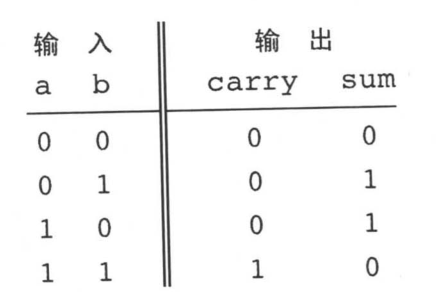
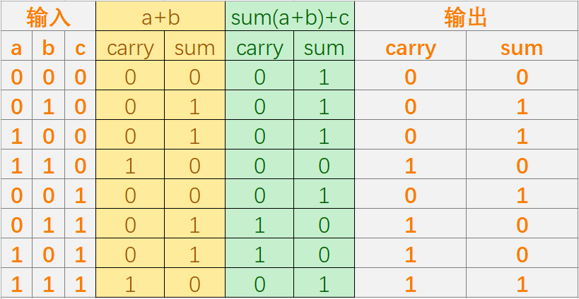
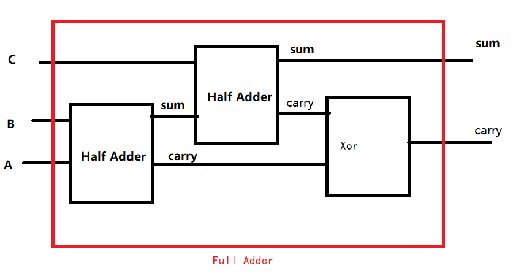
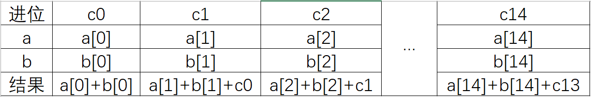

# lab02简介

> **目标**：实现本章介绍的所有芯片。你可以使用的模块包括在前面章节中介绍的芯片，以及你逐渐构建起来的芯片。
>
> **提示**：当你的HDL程序调用前面已经构建的芯片时，建议使用这些芯片的内置(built-in)版本。这样做是为了确保正确性并加速硬件仿真器的操作。使用芯片内置版本的简单方法是：保证你的项目路径仅仅包含属于当前项目的.hd1文件。
>
> 本项目中的其他步骤跟前面一章的项目步骤一样，只是最后一步应该被替换成“对projects/02路径下的所有芯片进行构建和仿真”。

code

- 存放hdl代码

out&cmp&tst

- 存放输出文件、比较文件、测试数据

以上文件均可用文本文档打开。

# 我们已经实现了什么？

到目前为止，我们已经实现了以下芯片：

基本与或非门：Not、And、Or

Xor、Mux、DMux

16位Not、Anderson、Or、Mux

多通道Or、Mux、DMux

# 本节实验

## 半加器 HalfAdder

我们把a,b,carry; a,b,sum 分别拿出来看

发现carry是ab都是1的时候才是1，因此为ab

sum是ab不同为1，相同为0，因此为a异或b

## 全加器 FullAdder

我们很容易想到使用已经构建好的半加器实现一个全加器。

先试着把ab相加，然后从ab相加的输出结果中寻找最终结果和ab相加结果的关系。

可以看出，最终的sum为a+b的sum与c相加，而最终的carry为a+b的carry+（sum+c的carry）

## 16位加法器 Add16

有了全加器和半加器，我们很容易就能实现一个加法器，先用半加器把两个16位输入的最低位相加，然后用全加器依次将每一位的进位和每一位的输入相加，最后舍弃最高位进位即可。

## 增量器  Inc16

将in的输入与0000000000000001相加即可。

注意：

- HDL语言中不可以直接与数字相加，必须将响应的位置置为true或者false

比如：
$$
Add16(a=in,b[0]=true,b[1..15]=false,out=out);
$$

## 算数逻辑单元 ALU

