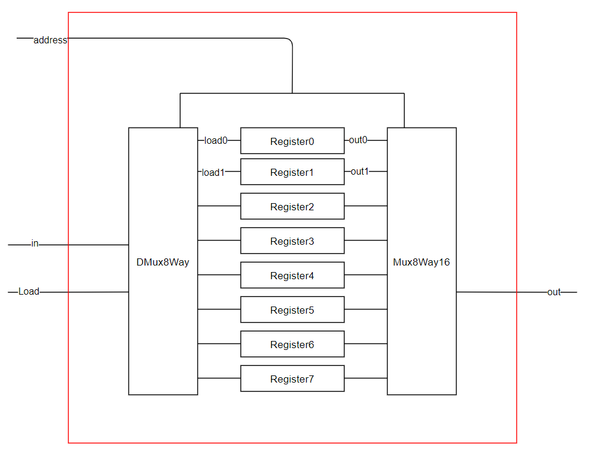

# lab03简介

> **目标：**构建本章所有的芯片。你可以使用的模块是原始的 DFF 门及构建于其上的芯片，以及前面章节里面介绍的芯片。
>
> **资源：**本项目所需要的唯一工具就是与本书配套的硬件仿真器。所有的芯片应该用附录A中的HDL语言来实现。跟前面一样，对于每个芯片，我们提供一个骨干．hd1程序（即没有给出具体实现部分），另外还有供硬件仿真器进行仿真测试的.tst 脚本文件，以及．cmp比较文件。你的工作就是要完成．hd1程序的实现部分。
>
> **约定：**当程序被加载到硬件仿真中后，你的芯片设计（．hd1程序）应由．tst文件来进行测试，并在.cmp文件中产生输出。若结果不如所料，仿真器会给出相应的提示。
>
> **提示：**D触发器（DFF）门被认为是原始门，因此没有必要去构建它：当仿真器在HDL 程序中遇到DFF门时，它会自动调用内置在tools／builtIn／DFF．hd1中已经实现的DFF 门模块。
>
> 本项目的路径结构 用较小的RAM芯片构建较大的RAM 芯片时，推荐使用前者的内置（built-in）版本。否则，仿真器可能会运行得非常缓慢，甚至溢出内存空间，因为大RAM 芯片包含成千上万的底层芯片，在仿真过程中，所有这些芯片的实现都以软件对象的形式被仿真器装入计算机内存。基于这个原因，我们将 RAM512．hd1、RAM4K．hd1、RAM16K．hd1程序放在单独的路径里。这样，对RAM4K和RAM16K芯片的向下递归构建是到RAM512芯片为止的，因为构建RAM512芯片的更底层芯片是内置的（仿真器在这个路径下找不到它们的程序）。
>
> 步骤推荐按照下面的顺序来进行：
>
> 0. 本项目需要的硬件仿真器在软件包的tools路径下可以找到。
> 1. 阅读附录A,尤其的是A.6和A.7。
> 2. 浏览硬件仿真器指南，尤其是第IV和V部分。
> 3. 构建和仿真在project/03目录下给出的所有芯片。

code

- 存放hdl代码

out&cmp&tst

- 存放输出文件、比较文件、测试数据

以上文件均可用文本文档打开。

# 我们已经实现了什么？

到目前为止，我们已经实现了以下芯片：

基本与或非门：Not、And、Or、Xor、Mux、DMux

16位Not、And、Or、Mux

多通道Or、Mux、DMux

半加器HalfAdder、全加器FullAdder、加法器Add16、增量器Inc16以及算术逻辑单元ALU

# 本节实验提示

### 1比特寄存器 Bit

在load为1的时候改变out的输出为in输入。

显然用Mux芯片。

书中已经给出了1比特寄存器的实现方式

> 管脚只能有一个输入，却能有多个输出，因此我们可以把DFF的输出一份输出到芯片外面，另一份输入到Mux中

### 16位寄存器 Register

16位寄存器，每一位都是一个1bit的寄存器，直接连上就ok

### RAM  8B

首先我们知道8B的寄存器由8个16位的寄存器组成，因此8BRAM中会有8个Register

当使用了address进行地址选择的时候，我们会根据地址选择一个Register进行操作，此时我们可以想到使用DMux8Way来将load信号分为8份，然后将8个信号分别传送给8个Register，因为DMux的特性，选中的Register得到的load信号为1，其他为0，这样就完成了对制定的Register的操作。

然后需要将目标Register的out信号输出出来，经过上一步的操作，我们一共得到了8个输出。

使用Mux8Way16，将刚刚得到的8个输出进行输入，然后将address信号接入sel选择，就得到了我们想要的out信号输出。

原理图如下：

### RAM 64B\512B\4K\16K

原理同上

address的高几位选择RAM，低几位选择下一级RAM中的地址

不再赘述。

### 程序计数器 PC

判断逻辑使用Mux芯片，这里我们使用Mux16。

正向逻辑是 reset、load、inc

反向进行判断，先判断inc再判断load然后是reset

最后写入寄存器

写入寄存器之后再自增 1

