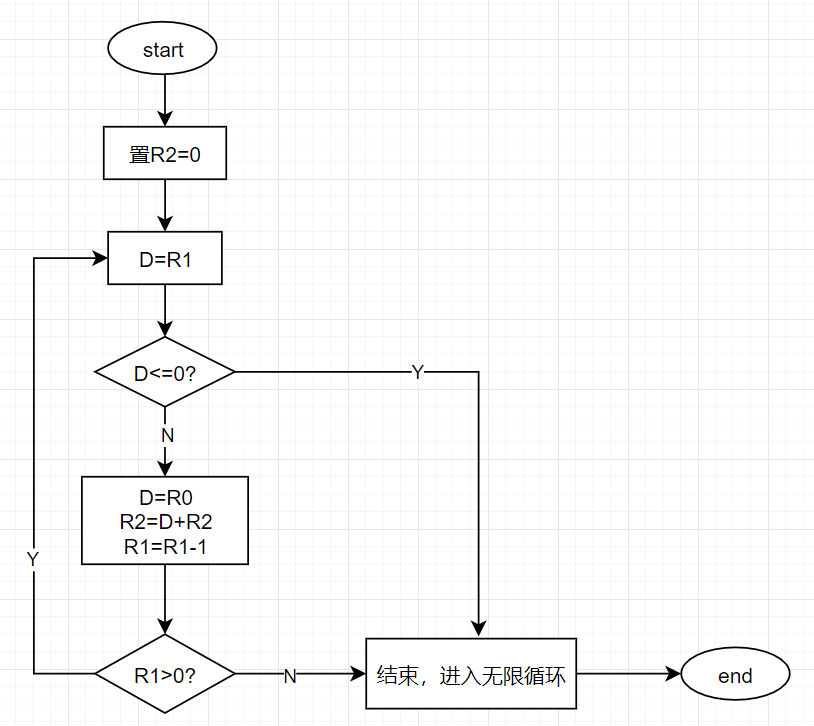

# lab04简介

> **目标：**初步了解机器语言底层编程，熟悉Hack计算机平台。在做本项目的过程中，你会熟悉汇编过程，同时也能形象地理解翻译后的二进制码是如何在目标硬件上执行的。
>
> **资源：**在这个项目里你将会用到本书配套软件包的两个工具：汇编编译器，用来将Hack汇编程序翻译成二进制码；以及CPU仿真器，用来在虚拟的Hack平台上运行二过制程序。
>
> **约定：** 编写并测试下面两个程序，你的程序在CPU仿真器上执行时，应该会经由项目路径中的测试脚本的领引，从而产生相应的结果。
>
> **乘法程序（Mult．asm）**：该程序的输入值存储在RO和R1中（也就是内存的两个起始内存单元）。程序计算R0＊R1的值并将其存入R2。我们假设（此程序中）RO＞＝0，R1＞＝0，R0＊R1＜32768，虽然这些条件程序自身不用去检测，但是作为程序设计者的你必须保证它们成立。提供的Mult.tst和Mult.cmp脚本会用一些典型的数据值来测试你的程序。
>
> **I／O 处理程序（Fil1．asm）**：这个程序是一个无限循环，它侦测键盘的输入。当按下任一键时，程序将屏幕变黑，即将“black”写入每个像素。当没有键按下时，屏幕应该被清屏。你以任何空间顺序来选择屏幕的变黑和清屏，只要连续地按一个键足够长时间，屏幕就会全黑，长时间不按键就会清屏。这个程序有测试脚本（Fi11．tst）但是没有比较文件（.cmp），只有通过对模拟屏幕的观察来检查执行结果。
>
> **步骤：** 推荐按如下步骤进行:
>
> 0. 该项目所需要的汇编编译器和CPU仿真器在本书配套软件包中的tools路径下。使用它们之前,请先阅读汇编编译器参考手册和CPU仿真器参考手册。
> 1.  使用普通的文本编辑器编写第一个汇编程序,将它保存为projects/04/mult/Mult.asm。
> 2.  使用提供的汇编编译器(以批处理或者交互模式)来翻译你的程序。如果程序中有语法错误, 回到步骤1。如果没有语法错误,编译器将产生名为projects/04/mult/Mult.hack的包含二进制机器指令的文件。
> 3. 使用提供的CPU仿真器来测试生成的Mult.hack代码。测试过程可以使用Mult.tst脚本以交互方式或者批处理方式来实现。如果产生了运行期错误,返回到步骤1检查。
> 4. 对第二个程序(Fill.asm)重复步骤1~3,路径为projects/04/fill.

code

- 存放asm代码

out&cmp&tst

- 存放输出文件、比较文件、测试数据

以上文件均可用文本文档打开。

# 项目

## 两数相乘

思路：

R0\R1\R2

将R0和R1内的值相乘存放到R2中，R1控制循环次数，每次将R0+R2存放在R2中。

流程图：

## 屏幕显示

RAM的16384-24575地址存放的是屏幕上的所有像素。

24576存储的是键盘有没有按下。

因此我们读取24576的值，判断是不是0，如果是0，就代表没有按下键盘，就向屏幕清零变白。

如果按下了，就把屏幕变黑。

值得注意的是，1的二进制为0000000000000001，输入的屏幕上代表的是15位的白色和1位的黑色。

-1的二进制是16个1，才是真正的黑色。

